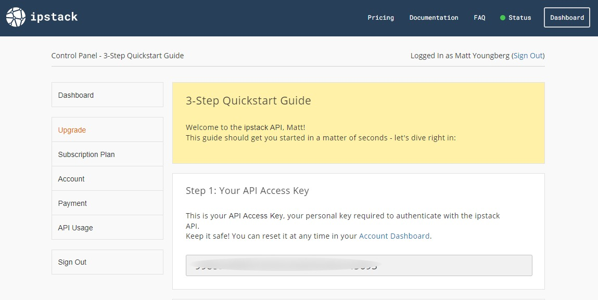
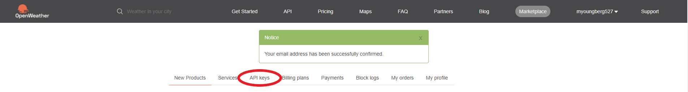
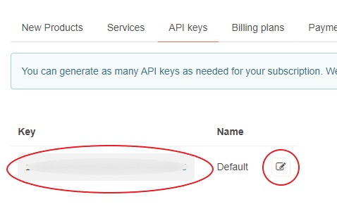

# Weather Reporter - Java Application

A quick, easy way to get your local weather from the convenience of your command line.

---

## Example

After you've performed some initial setup and built the project with Maven, simply run the following command:

```java -jar /path/to/jarFile```

You should see output like this:

```
Here is the current weather in Garden City:

Weather: Clear
Temperature: 40°F
Feels Like: 32°F
High: 41°F
Low: 39°F
Windspeed: 6.93mph
Sunrise: 8:08AM
Sunset: 5:08PM
```

Except that it will contain the current weather at your IP's geolocation.

---

## Setup

### Requirements

This project assumes you have the following installed on your machine and available on your PATH:

- Java 11 or greater
- Maven

After cloning the repository onto your machine, we need to get a couple of API keys.

### Acquiring the API keys

#### IPStack


A request by the program to IPStack will tell this program the latitude and longitude of the machine's location.

##### Steps

- Go to IPStack's website at https://ipstack.com.
- Click "Get Free API Key" in their navigation bar.
- You'll be taken to a page that displays their pricing. The "Free" tier will have a button that simply says "Get Free API Key".
- After filling out their form, you'll be taken to the dashboard. Your API Key should be front and center:



- Take this API key and navigate to `.\weather-reporter\src\main\java\resources\config.properties`. Open it in a text editor.
- Paste your API Key as the corresponding value to the key "IPStackAccessKey".
- Save your file.

#### OpenWeatherMapAPI


A request by the program to OpenWeatherMap's Current Weather Data API will get the relevant datapoints for the output of the program.

##### Steps

- Go to OpenWeatherMap's API page at https://openweathermap.org/api.
- Under the "Current Weather Data" grouping on the webpage, click "Subscribe".
- You'll be taken to a page that displays their pricing. The "Free" tier will have a button that simply says "Get API Key".
- After filling out their form, you'll be taken to a new page and asked how your API access will be used. Fill out their fields as you see fit and hit "Save".
- You'll be prompted to verify your email. Do so.
- After verifying, you'll be taken to https://home.openweathermap.org/. Click the "API Keys" tab:



- You'll see your "Default" API key on the page. Hit the copy icon to copy it to your clipboard:



- Go back to `.\weather-reporter\src\main\java\resources\config.properties` and paste your API Key as the corresponding value to the key "OpenWeatherMapAPIKey".
- Save your file.

### Configuring for Units

The third configuration you'll see in the `config.properties` file is your "Metrics". This changes how the weather data is displayed. Set it to one of three values (case-insensitive):

- **Imperial** (For the U.S.: &#176;F, mph)
- **Metric** (For most places outside the U.S.: &#176;C, m/s)
- **Standard** (For scientific measurement: &#176;K, m/s)

### Building the .jar file

Now with your API keys in place and your units configured, you're ready to build the project. The POM in this project will take care of the bundling of a single .jar file that can be ran with your java virtual machine.

To build the project, simply navigate into the base directory of the project and run:

```mvn package```

This process, once completed, will create two .jar files in the `.\target` directory:

1) The first, named `weather-reporter-<current-version>.jar` is one built with the classes native to the project, but without its two external dependencies. You're likely not interested in this one.
2) The second, named `weatherreporter-complete.jar` comes bundled with the dependencies and can run standalone.

---

## Running the .jar file

To check your current weather at your computer's location, simply run this in your command line from the project's directory:

```java -jar .\target\weatherreporter-complete.jar```

The program will execute, and will print something similar to the following in your window:

```
Here is the current weather in Garden City:

Weather: Clear
Temperature: 40°F
Feels Like: 32°F
High: 41°F
Low: 39°F
Windspeed: 6.93mph
Sunrise: 8:08AM
Sunset: 5:08PM
```

---

Feel free to contribute to the repository through pull requests, submitting issues, and/or the like! I appreciate any and all contributions.

-_Matt Youngberg_